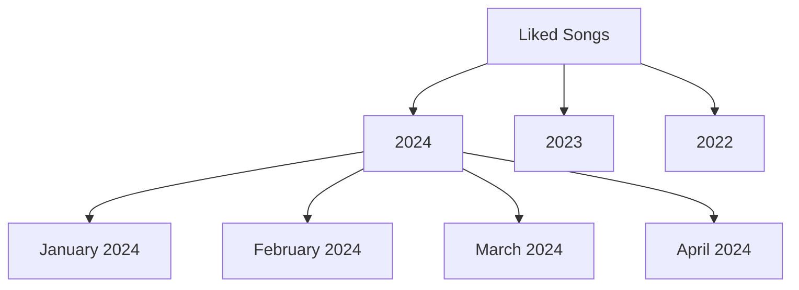

# barchiver

The goal of this project is to provide a simple way to generate archival playlists for your music library.

## Roadmap

- [ ] Create a simple CLI
- [ ] Work with Spotify API
- [ ] Generate playlists based on year/month
- [ ] Create a TUI and a installable package
- [ ] Specify playlist naming/structure
- [ ] Integrate Apple Music
- [ ] Integrate YouTube Music
- [ ] Allow for generated playlist covers
- [ ] ???
- [ ] Profit

## Known Limitations
### Spotify
- The Spotify API currently does not allow for moving a group of playlists into a folder. An operation which you can do on Mobile, Web, Desktop. Why can't the API do this? I don't have a clue.

## Personal Goals

For this project I wanted to develop in python in the open. I also wanted to more strictly follow TDD.

### Useful links for development
[Spotify API](https://developer.spotify.com/documentation/web-api/)